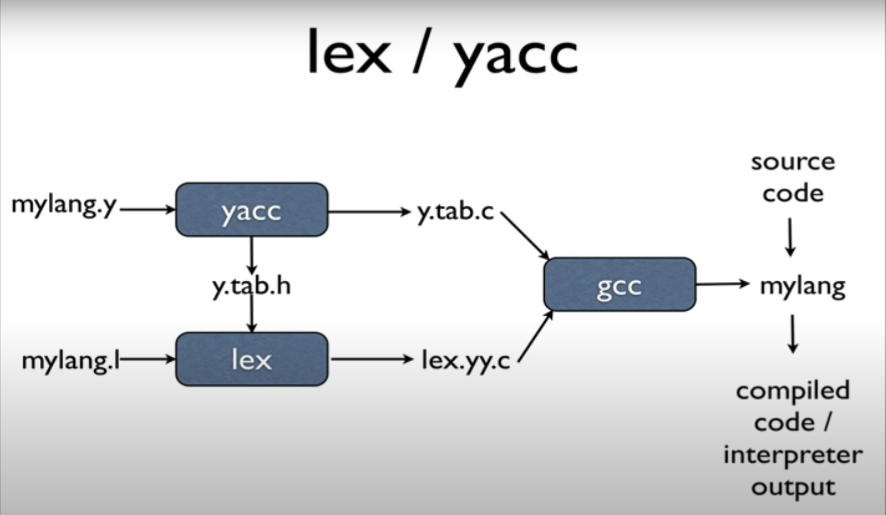

# LL(1),SLR(1),LR(1)

## LL1->LL1.cpp  LL1.txt  ------ LL(1)自顶向下语法分析

## SLR1->SLR1.cpp SLR1.txt ------ SLR(1)自底向上语法分析

## LR1->LR1.cpp  LR1.txt  ------ LR(1)自底向上语法分析

# lex learning

## myscanner ------ flex的一个例子 [lex turtorial](https://www.youtube.com/watch?v=54bo1qaHAfk "lex turtorial")

# yacc learning

## mycalc ------ bison的一个例子 [yacc turtorial](https://www.youtube.com/watch?v=__-wUHG2rfM "yacc turtorial")

## myAnotherCalc ------ bison的另一个例子 [yacc turtorial](https://www.youtube.com/watch?v=yTXCPGAD3SQ)

## helloWorld ------ bison的另一个例子 [yacc turtorial](https://www.youtube.com/watch?v=POjnw0xEVas&list=PLIrl0f9NJZy4oOOAVPU6MyRdFjJFGtceu&index=1)

## miniCompile ------ bison的另一个例子 [yacc turtorial](https://github.com/sanved77/mini-compiler)

## pl0ToScheme ------ bison的另一个例子 [yacc turtorial](https://github.com/kondokazuhiro/pl0-to-scheme)

## completeExample ------ bison的另一个例子 [yacc turtorial](https://blog.csdn.net/huyansoft/article/details/8860224)

